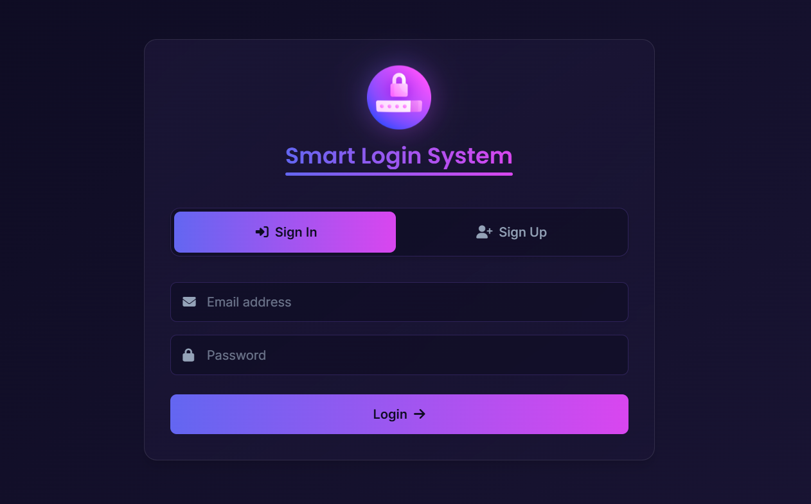

# 🔐 Smart Login System

<div align="center">
  
  <h3>Secure and user-friendly authentication solution</h3>
  <p>A modern web application with a complete registration and authentication flow</p>
</div>

## 📋 Project Overview

This project was developed as part of the [Route Academy](https://www.linkedin.com/company/routeacademy/) Full Stack Development Program. It represents the fourth JavaScript assignment in the curriculum, focusing on implementing a secure authentication system with user registration and login functionality.

<div align="center">
  <a href="https://mohamedv0.github.io/smart-login-system/">
    
  </a>
</div>

## 💫 Interface Preview

<div align="center">
  
  
  <a href="docs/ui-screenshots">
    
  </a>
</div>

## ✨ Features

- 📝 **User Registration** with name, email, and password
- 🔒 **Secure Login** with email and password
- 🛡️ **Password Hashing** with PBKDF2 and random salts for enhanced security
- ✅ **Real-time Input Validation** with meaningful error messages
- 🔑 **Session Management** with localStorage
- 🚪 **Protected Routes** for authenticated users only
- 👤 **User Profile Display** with login timestamp
- 📱 **Responsive Design** for all devices
- 🎨 **Modern UI** with smooth transitions and animations

## 🛠️ Technology Stack

<div align="center">

### 🎨 Frontend Technologies
[](https://skillicons.dev)

### 📚 Libraries & Frameworks
[](https://sweetalert2.github.io/)
[](https://fontawesome.com/)
[](https://getbootstrap.com/)
[](https://github.com/brix/crypto-js)

### 💻 Development Tools
[](https://code.visualstudio.com/)
[](https://git-scm.com/)
[](https://github.com/)

</div>

## 📁 Project Structure

```
Smart Login System/
├── css/
│   ├── all.min.css (Font Awesome)
│   ├── bootstrap.min.css
│   ├── main.css (Custom styles)
│   └── sweetalert-custom.css
├── docs/
│   ├── project-requirements.md
│   └── ui-screenshots/
│       └── Hero.png
├── images/
│   └── Login.png
├── js/
│   ├── auth.js (Main application logic)
│   ├── bootstrap.bundle.min.js
│   └── sweetalert-config.js
├── webfonts/ (Font Awesome icon fonts)
├── index.html
└── README.md
```

## 🚀 How to Use

1. Clone the repository
   ```bash
   git clone https://github.com/MohamedV0/smart-login-system.git
   ```
2. Open `index.html` in your browser
3. Create a new account via the Sign Up tab
4. Log in with your credentials
5. View your profile information on the Home page
6. Log out when finished

## 📊 Code Organization

The JavaScript code follows an object-oriented pattern with separate classes for:

- **UserManager**: Core functionality for user authentication and management
- **Validator**: Form validation and error messages
- **UI**: UI updates and interactions
- **Utilities**: Helper functions for common tasks, including secure password hashing implementation

## ✅ Requirements Fulfilled

This implementation meets all the requirements specified in the [project requirements](./docs/project-requirements.md):

| Requirement | Implementation |
|-------------|----------------|
| Registration | ✅ Collects name, email, and password with validation |
| Login | ✅ Authenticates users against localStorage data |
| Home (Protected Route) | ✅ Shows welcome message and prevents unauthorized access |
| Logout | ✅ Clears session and redirects to login |
| Data Persistence | ✅ Uses localStorage for user data and session management |
| Input Validation | ✅ Real-time validation with meaningful error messages |
| Security | ✅ PBKDF2 password hashing with random salts for data protection |
| Clean UI/UX | ✅ Modern design with smooth transitions and feedback |

---

<div align="center">
  <p>Developed with ❤️ by <a href="https://github.com/MohamedV0">Mohamed Ashraf</a> as part of <a href="https://www.linkedin.com/company/routeacademy/">Route Academy</a> Full Stack Program</p>
  <p>
    <a href="https://github.com/MohamedV0"></a>
    <a href="mailto:mohamed.ashraf.v0@gmail.com"></a>
    <a href="https://www.linkedin.com/in/mohamed-ashraf-v0/"></a>
    <a href="https://mohamedv0.netlify.app/"></a>
  </p>
</div>